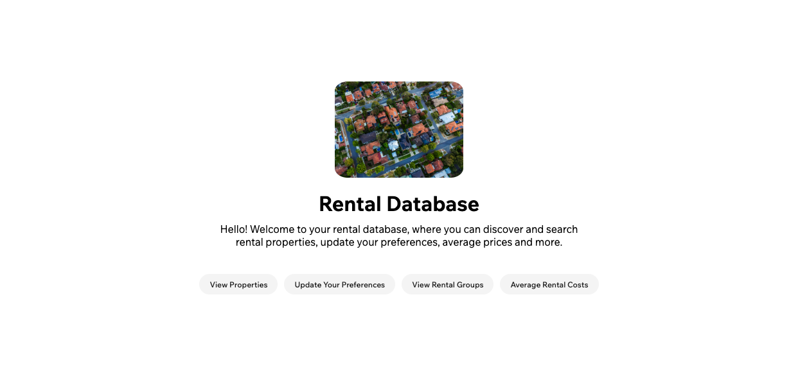

<h1 align="center">Rental Database Application</h1>

<strong>CISC332 (Database Management Systems) Project</strong>
 
<h2>About</h2>
Context and progress go here

<h2>Goal and requirements</h2>

Create a fully functioning web-based interface for a rental database leveraging HTML, PHP and SQL.

<h2>Key Features</h2>

- Can view all propertiy IDs and their associated Owner and Manager
- The user can update their rental group preferences after providing their associated rental group
- The user can display all of the rental groups, as well as each groups preferences and members
- View the average rent prices for their associated rental category [Houses, Apartments and Rooms]
